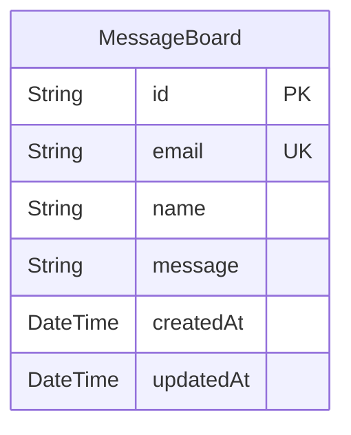

# ERD
> Generated by [`prisma-markdown`](https://github.com/samchon/prisma-markdown)

- [default](#default)

## default

### `MessageBoard`

**Properties**
  - `id`: 
  - `email`: 
  - `name`: 
  - `message`: 
  - `createdAt`: 
  - `updatedAt`: 